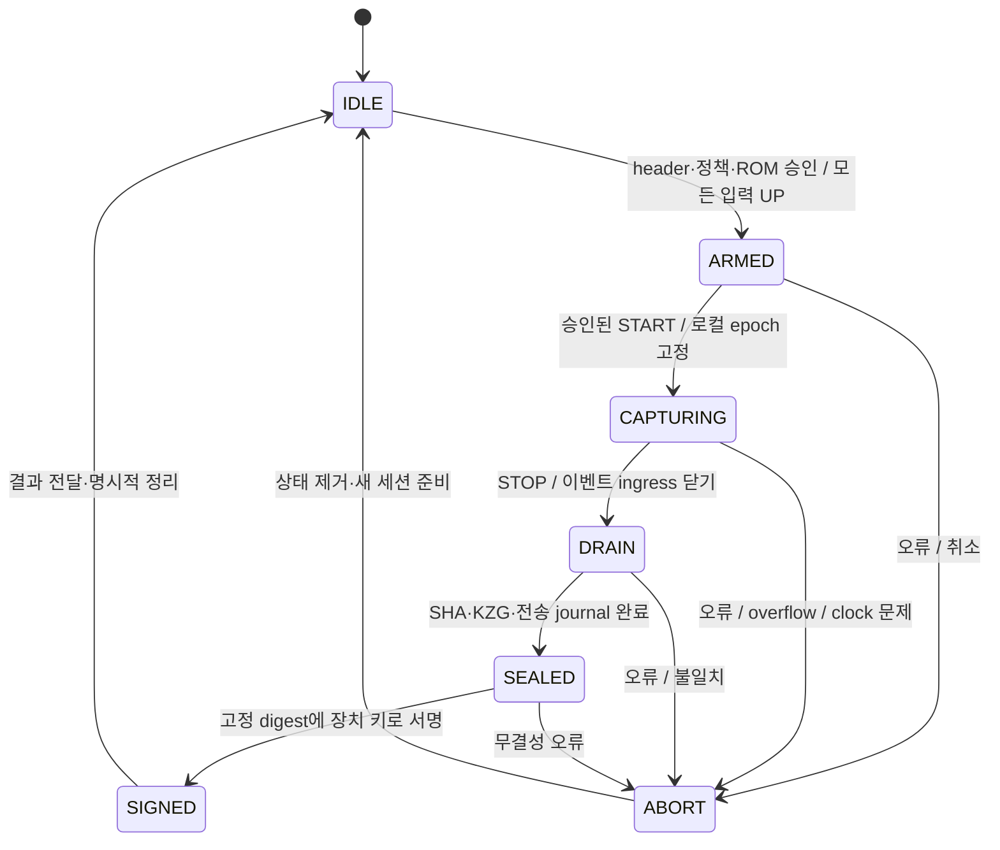

# 장치·sidecar·contract 연동

이 문서의 장치 FSM, 전송 메시지, 오류 코드는 **신규 구현 제안**이다. 현재 저장소에 RTL, USB protocol, SE050 driver 또는 실제 capture adapter는 없다. Contract 함수와 Rust API 설명은 현재 구현을 기준으로 한다.

## 1. 한 세션의 실행 순서

1. 운영자가 승인된 SRS와 그 SRS로 배포한 `GkrScoreVerifier`를 준비한다. FPGA ROM, sidecar SRS, verifier key의 동일성을 provisioning 단계에서 확인한다.
2. 운영자가 `ManiaGkrRegistry.registerChart(chartBytes, commitment, proof)`로 채보를 등록하고 `setDevice(signer, bitstreamHash, true)`로 장치를 등록한다.
3. 운영자가 `openSession(matchId, chartHash, player, device, expiresAt, 2)`를 호출한다. 반환된 ID로 `getSession(id)`, `getChart(chartHash)`를 읽는다.
4. Sidecar가 registry가 확정한 header와 승인된 capture 조건을 장치에 전달한다. 장치가 검증한 후 header를 잠근다.
5. 장치가 입력 수집을 시작한다. 이벤트를 한 번 확정할 때 trace 보관/전송, SHA, KZG에 동일한 record를 전달한다.
6. 종료 시 입력을 닫고 이미 확정한 이벤트를 모두 처리한다. 로컬 시계 기준 `D`, 최종 `n`, `root`, `C_E`를 고정하고 V2 digest에 서명한다.
7. Sidecar가 전체 trace와 장치 결과를 독립 재계산하여 비교한다. 일치하는 원본 세션으로 witness와 proof를 만든다.
8. `submitCommitted`에 장치의 원본 결과와 signature, proof를 제출한다. 성공하면 session이 consumed로 기록된다.

### Contract의 실제 제출 ABI

```solidity
struct Submission {
    uint64 duration;      // 장치가 서명한 D, microseconds
    uint8[4] laneBits;    // prover가 계산, L0..L3
    uint32[5] counts;     // J320, J300, J200, J100, J50
}
function submitCommitted(
    bytes32 id,
    uint32 n,
    bytes32 root,
    uint256[2] traceCommitment, // canonical affine [x, y]
    Submission sub,
    uint256[] proof,
    bytes sig                 // r_BE32 || s_BE32 || v_u8
) external;
```

`counts`에 MISS는 들어가지 않는다. 검증기가 채보 component 수에서 성공 판정 수를 빼서 MISS를 구하고 점수를 계산한다. `laneBits`와 counts는 장치가 주장할 필요가 없다. 원본 trace로 sidecar가 만들며 proof가 바인딩한다. 누구나 relay할 수 있어 transaction sender와 player가 같을 필요는 없다.

세션은 `block.timestamp <= expiresAt`일 때만 제출할 수 있다. 재생 시간뿐 아니라 drain, 서명, proof 생성, transaction 지연을 포함한 deadline을 운영자가 잡아야 한다. 장치가 서명했어도 제출 전에 장치가 revoke되거나 등록 bitstream hash가 바뀌면 거부된다. 성공한 세션은 재사용할 수 없고, revert된 제출은 소비되지 않는다. 모드 B 세션을 모드 A로 바꾸려면 새 세션을 발급해야 한다.

## 2. 권장 capture FSM



### ARM에서 검사하고 잠글 것

- Header의 모든 필드, mode=2, V2 input policy, ruleset, 장치 signer/bitstream identity, 승인된 chain/registry.
- Chart hash 및 종료 기준에 필요한 `maxEnd`; `maxEnd + 136500 <= D <= 1800000000`을 충족할 수 있는지 확인한다.
- 승인된 SRS ROM 식별자와 checksum, 현재 firmware/bitstream 구성.
- 이전 세션 상태가 없고 물리 입력이 모두 해제된 상태인지 확인한다. 처음부터 눌린 키를 임의 UP 이벤트로 보정하지 않는다.

현재 contract는 장치가 오프라인에서 header의 registry 출처를 검증할 수 있는 별도 organizer 서명 형식을 제공하지 않는다. 승인된 sidecar/firmware 경로를 신뢰할지, organizer가 서명한 ARM envelope를 추가할지는 **시스템 설계 결정**이다. `maxEnd`, START 조건, SRS 식별자는 현 V2 header에 직접 들어 있지 않으므로 host가 전달한 값을 곧바로 신뢰하지 않도록 provisioning/인증 경로를 정해야 한다. 새 envelope를 넣더라도 V2 digest 규격을 임의 변경하지 않는다.

### CAPTURING에서 보장할 것

- Timestamp는 host가 제공하는 이벤트 시간이 아니라 장치 로컬의 microsecond counter에서 읽는다. `t=0` epoch와 오디오/게임 START 동기화 방식은 보드 통합 시 결정한다.
- Debounce 후 확정된 edge마다 한 번만 global seq를 배정한다. 동시에 확정된 lane은 고정된 우선순위 등 결정적 방식으로 직렬화한다. 같은 timestamp는 허용된다.
- 이벤트 수·seq·SHA chunk 수·KZG index·trace journal의 cursor가 같은 확정 이벤트를 가리켜야 한다. SHA 또는 KZG만 앞서고 다른 consumer가 놓치는 경로를 만들지 않는다.
- Backpressure로 물리 edge를 멈출 수는 없다. FIFO 용량과 drain 처리량을 설계하고, 기록하지 못한 edge가 있으면 세션을 abort한다. 이벤트를 버린 뒤 정상 signature를 내보내면 안 된다.
- 50,000번째 이벤트까지 허용한다. 50,001번째 이벤트가 발생하면 truncate하거나 seq를 wrap하지 말고 abort한다.
- 입력의 held state를 관리한다. 중복 DOWN, 대응 DOWN 없는 UP, 감소 timestamp는 정상 stream으로 서명하지 않는다.

Debounce interval, 동시 edge의 우선순위, clock 정확도/드리프트 허용값은 현 프로토콜에 수치로 정의돼 있지 않다. 승인된 입력 정책과 bitstream 구성에서 고정하고 실제 장치 시험으로 검증한다. 게임 판정창을 debounce 기준으로 사용하면 안 된다.

### DRAIN / SEALED / SIGNED

STOP을 이벤트 수락 경계와 원자적으로 처리한다. 수락된 모든 이벤트의 timestamp가 `D` 이하가 되도록 `D`를 같은 로컬 시간축에서 확정한다. 마지막 partial SHA chunk는 실제 count로 한 번만 해시한다. 정확히 32의 배수이거나 이벤트가 없으면 빈 chunk를 추가하지 않는다.

KZG queue가 완전히 drain된 뒤 projective 누적점을 canonical affine으로 바꾼다. Identity는 64 zero bytes다. 최종 `header, n, D, root, C_E`가 고정된 이후 digest를 계산한다. Signature 생성 이후 이 필드 중 하나라도 바뀌면 같은 결과 객체가 아니다.

서명 경로는 이 FSM에서 확정된 digest만 받아야 한다. Host가 지정한 digest, SHA root 또는 commitment를 서명하는 일반 API를 노출하지 않는다. 보안 소자가 외부 명령으로 임의 hash에 서명할 수 있다면 FPGA 측 FSM만으로 물리 입력의 신뢰성을 보장할 수 없다. 키 접근 경로와 firmware 승인까지 함께 구현해야 한다.

Reset/power loss가 발생한 불완전 세션은 기본적으로 abort한다. 복구 기능을 추가하려면 seq, held state, 시간 epoch, SHA chunk/chain, KZG accumulator, 송신 journal을 원자적으로 복원하는 설계가 별도로 필요하다. 마지막 signature와 결과를 보관해 재전송하는 것은 허용할 수 있지만 새 이벤트를 붙이지 않는다.

## 3. 전송 계층에 필요한 논리 메시지

아래는 **구현할 의미 계약**이며 확정된 USB packet 번호나 ABI가 아니다. 패킷 크기, framing, CRC, timeout, flow control은 보드/링크 결정 후 고정한다. 전송 CRC는 세션 서명을 대체하지 않는다.

| 방향/메시지 | 최소 내용 | 처리 규칙 |
|---|---|---|
| host→device ARM | mode, 원본 header, 승인된 capture 설정 및 provisioning 참조 | 전체 검증 후 한 번 고정 |
| host→device START/STOP | session ID, 명령 sequence 또는 중복 판별 값 | epoch/종료 경계는 장치가 확정 |
| device→host EVENTS | session ID, first sequence, event count, canonical event bytes | 재전송해도 기존 이벤트 seq를 유지 |
| device→host STATUS | FSM, accepted/processed/sent 수, 오류 latch, ROM ID | 확정 결과와 진단 상태를 구분 |
| device→host RESULT | 원본 header, n, D, root, C_E, digest, signature | 마지막 trace packet보다 먼저 완성됐어도 host는 trace 완결성을 확인 |
| 양방향 ACK/RETRY | session ID, 수신 완료 구간 | 중복 event를 새 입력으로 추가하지 않음 |
| device→host ABORT | session ID, 최초 오류 코드, 마지막 확정 seq | 정상 RESULT/signature 발행 금지 |

장치에 전체 trace를 보관한다면 최악의 canonical payload는 `50000 × 14 = 700000 bytes`다. Streaming만 사용해도 host/sidecar는 전체 trace를 보관해야 witness를 만들 수 있다. 모드 B가 trace를 calldata에서 제외한다는 사실은 trace를 폐기해도 된다는 뜻이 아니다.

## 4. 반드시 추가할 sidecar adapter

현재 `api::prove`는 실장치 capture를 인증하는 API가 아니다. 다음 adapter가 필요하다.

1. 저장된 registry session/header와 device RESULT의 모든 필드를 byte 단위로 비교한다. 승인된 chart bytes/hash/commitment와 local SRS/VK도 비교한다.
2. 전체 trace의 seq, timestamp, lane/action, held state, event count, duration을 검증한다.
3. 원본 header의 session ID로 SHA chain을 재계산하여 장치 root와 비교한다.
4. 승인된 SRS로 `device_trace_commitment`를 재계산하여 **장치 C_E**와 비교한다.
5. 원본 필드로 V2 digest를 재계산하고 장치 서명을 검증한다. DER 변환/low-s/recovery 작업은 [바이트 규격](01-device-protocol.md)의 규칙을 따른다.
6. 그 다음 witness를 만든다. `api::statement` 또는 그와 동일한 구성으로 원본 header/footer와 장치 C_E가 들어간 statement를 만든 뒤 `scoring::prover::prove`를 호출한다. Native proof 검증도 수행한다.
7. 실제 제출용 `id, n, root, C_E, duration, sig`는 검증한 장치 RESULT에서 가져온다. Proof와 statement가 그 원본 digest를 사용했는지 마지막으로 비교한다.

**현재 편의 함수의 주의점:** `api::prove`의 mode B 경로는 input policy를 B로 덮어쓰고 C_E를 software에서 다시 계산한다. `witness::build_from_input`은 원본 header 전체를 인증하지 않는다. Native `api::verify`도 registry session/device signature를 검증하지 않는다. 따라서 이 함수의 성공만으로 장치 입력을 인증했다고 처리할 수 없다.

`forge::prove_session` 및 CLI의 `prove-session`은 테스트용 합성 trace를 새 header에 **rebind하고 root를 재계산**하는 helper다. 실장치 RESULT를 보존해 제출하는 adapter가 아니다. GKR 쪽에는 SP1 server와 같은 production HTTP 연동이 구현되어 있지 않다. SP1 server/배포 스크립트를 그대로 사용하지 않는다.

## 5. 작업 분담과 완료 기준

| 소유자 | 구현물 | 완료를 판정할 증거 |
|---|---|---|
| FPGA 입력 담당 | 동기화, debounce, epoch, edge/seq FSM, FIFO | 같은 시각·bounce·50,001번째 edge·reset 시험 및 무누락 trace |
| FPGA 암호 담당 | SHA chain, BN254 G1 datapath, ROM loader, digest | 제공 벡터의 모든 중간값 일치; 최대 index/자원/타이밍 보고 |
| 보안 firmware 담당 | 키 provisioning, 승인된 digest signing, signature 변환 | 실제 부품의 raw-digest secp256k1 지원 확인, signer 주소와 on-chain recovery 일치 |
| Sidecar 담당 | capture adapter, 재전송, 원본 보존, proof/submission | 물리 입력→새 registry 세션→mode B 점수 기록 E2E |
| 운영/contract 담당 | trusted SRS, chart/device 등록, session lifecycle | ROM/VK 대응, device revoke·expiry·replay 거부 확인 |

착수 시 결정할 항목: FPGA/board, clock, BRAM/외부 memory, 예상 peak edge rate와 burst, 허용 STOP→signature 지연, START 동기화, 보안 소자 정확한 SKU/firmware, USB/기타 링크, ROM/bitstream 업데이트 인증과 rollback 정책. 미정인 상태에서 LUT/DSP/Fmax 또는 실시간 달성 여부를 확정할 수 없다.

원본 근거: [registry](../../contracts/src/ManiaGkrRegistry.sol), [API](../../../crates/gkr-evm/src/scoring/api.rs), [witness](../../../crates/gkr-evm/src/scoring/witness.rs), [forge helper](../../../crates/gkr-evm/src/forge.rs).


Current bridge support: `mania-gkr prove-sealed --srs FILE --input PLAY.json --mode a [--header ABI_HEADER]` preserves the sealed Mode A header/footer exactly and rejects inconsistent seals. It emits the same ABI word array as `prove-session`. The bridge must verify the device signature and on-chain session before invocation. `register-chart --srs FILE --input PLAY.json` emits canonical chart bytes, hash, commitment and registration proof as flat JSON.
