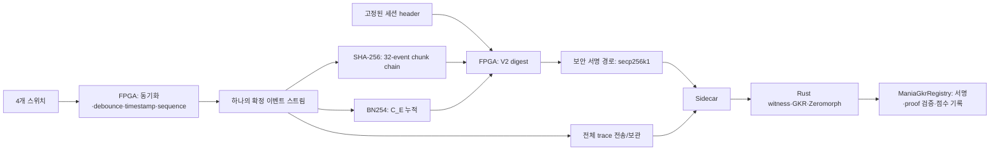

# FPGA 개발 handoff — GKR 입력 장치 / 모드 B commitment

기준일: 2026-09-25 · 대상: **4레인 입력 수집 장치와 모드 B KZG commitment 구현**.

FPGA는 스위치 입력을 자체 시간으로 기록하고, 같은 이벤트에서 SHA-256 trace root와 BN254 G1 commitment를 계산한 뒤, 고정된 세션 header와 최종 결과에 대해 장치 키로 서명하게 한다. 채점 witness, GKR/sumcheck proof, Zeromorph opening, Ethereum 제출은 host/sidecar의 역할이다.

이 패키지는 현재 Rust/Solidity 코드를 읽어 작성한 구현 handoff다. 실제 FPGA/SE050/USB 구현은 원본에 없으며, 아래 설계 제안은 이미 구현된 기능을 뜻하지 않는다. 보드·FPGA 부품·클럭·메모리·SE050 정확한 SKU/펌웨어는 지정되지 않았다.

## 읽는 순서

| 자료 | 독자가 얻을 내용 |
|---|---|
| [01-device-protocol.md](01-device-protocol.md) | 이벤트, SHA chunk, header/digest의 정확한 바이트 형식, 서명 규칙 |
| [02-kzg-hardware.md](02-kzg-hardware.md) | 모드 B 수식, BN254 산술, SRS/ROM, 메모리와 처리량 산정 |
| [03-integration.md](03-integration.md) | 장치 상태기계 제안, sidecar 연동, 실패 처리, 역할별 작업 |
| [04-validation.md](04-validation.md) | 제공 벡터 실행법, RTL 합격 기준, 이번 검증 결과와 한계 |
| [05-code-map.md](05-code-map.md) | 전체 코드의 구조·실행 경로, 기존 설명과 실제 코드 사이 주의점 |
| [06-prover-reference.md](06-prover-reference.md) | 장치 출력이 채점 proof와 연결되는 원리; 향후 prover 가속 참고 |
| [vectors/device-vectors.json](vectors/device-vectors.json) | 10개 case의 입력, SHA preimage/중간 root, 이벤트별 commitment, 최종 digest |
| [vectors/srs-manifest.json](vectors/srs-manifest.json) | 벡터용 SRS 식별자·형식·체크섬 |
| [vectors/srs-g1-be.bin](vectors/srs-g1-be.bin) | 개발용 G1 점 260개, `x_BE32 || y_BE32` |
| [tools/check_vectors.py](tools/check_vectors.py) | Rust 라이브러리를 호출하지 않는 Python SHA/곡선 연산 oracle |
| [source-manifest.json](source-manifest.json) | 검토한 원본 파일의 경로·크기·SHA-256 snapshot |

## 구현 경계

| 담당 | 구현/보관할 것 |
|---|---|
| FPGA | 이벤트의 물리적 출처와 시각, 순서, 누락 없는 기록, SHA chain, `C_E`, digest, 오류 latch, 세션 수명 |
| 보안 소자/신뢰되는 firmware | 등록된 secp256k1 키, 승인된 digest에만 서명하는 경로, 장치 provisioning |
| Sidecar | 확정 header 전달, 원본 trace 수신·검사, 장치 결과 비교, witness/proof 생성, 서명 형식 변환·제출 |
| Organizer/운영 | 채보 등록, SRS/ROM 승인, 장치 등록, 새 세션 발급, deadline |
| Contract | 세션·장치 승인 상태·서명·proof 검사, MISS/점수 계산, 재사용 차단 |

## 개발을 시작할 때 고정할 10가지

1. 레인은 `0..3`, action은 `0=DOWN, 1=UP`. HID key code가 아니다.
2. event는 **14 bytes**, `seq_BE4 || timestamp_us_BE8 || lane_u8 || action_u8`.
3. 모든 레인은 UP에서 시작한다. 같은 시각은 허용하며 `seq`가 순서다.
4. SHA chunk는 정확히 32개씩, 마지막만 1..32개. 빈 terminal chunk는 없다.
5. 모드 B도 SHA chain을 유지한다. `C_E`만으로 SHA root를 대체하지 않는다.
6. `C_E = Σ_j(t_j P[4j] + lane_j P[4j+1] + act_j P[4j+2])`; `P[4j+3]` 계수는 0.
7. G1 좌표 연산 modulus `q`와 scalar modulus `r`는 서로 다르다.
8. V2 digest preimage는 **430 bytes**. 주소는 20 bytes이며 ABI의 32-byte address word와 다르다.
9. `Header.verifier`에는 **ManiaGkrRegistry 주소**가 들어간다. GkrScoreVerifier 주소가 아니다.
10. host가 넘긴 임의 digest/commitment를 장치가 그대로 서명하는 API는 만들지 않는다.

## 현재 준비된 것과 남은 것

**확인된 소프트웨어:** 모드 A/B proving·검증, 채보 commitment 등록, 세션 서명 바인딩, Rust↔Solidity end-to-end, 입력/증명 변조 거부. 이번 재실행에서 GKR Rust 기존 26개와 Foundry 11개가 통과했다. 상세 로그와 추가 벡터 검증은 [검증 자료](04-validation.md)에 있다.

**구현해야 할 하드웨어:** RTL, clock/START 동기화, debounce 정책, overflow/reset 처리, SRS provisioning, 보안 소자 연동, DER→`r,s,v`, USB framing/재전송. 이 패키지에는 해당 기능의 실기기 검증이나 자원·타이밍 측정 결과가 없다.

`gkr-scoring/gkr/`는 별도 upstream 연구용 fork이며 현 채점 엔진의 런타임 의존성이 아니다. FPGA 구현은 `scoring/crates/gkr-evm/`와 `contracts/`를 기준으로 한다. `sp1-scoring`은 V1 의미와 신뢰 경계를 이해하는 데 사용했으며, SP1 prover/server/배포 절차는 handoff 대상에 포함하지 않는다. 공통 scoring crate는 이제 `scoring/crates/scoring-core`에 있으며 SP1 source와 runtime dependency는 제거되었다.

**전달 방법:** `docs/fpga/` 전체를 전달하면 수신자가 Python만으로 벡터 검증을 실행할 수 있다. Rust에서 재생성하려면 원래 workspace와 [fpga_vectors.rs](../../../crates/gkr-evm/examples/fpga_vectors.rs)가 필요하다. 제공 ROM은 공개 seed의 **개발용 SRS**이며 운영 장치에 사용하면 안 된다.
